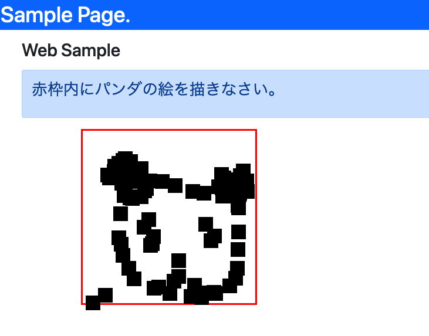

# ビルド
```
npm run build
```
*  dist/が作成され、ビルドした成果物が置かれます
* ファイルを保存すると、`npm run buid` をせずとも、自動で再ビルドしてくれるので、このコマンドを打つ機会はあまりないかも

# 開発サーバー起動
```
npm run serve
```
しばらくすると、ブラウザが自動で起動してきます

http://localhost:8080


# つくったもの



赤枠内をマウスクリックすると、ドットが打てます。